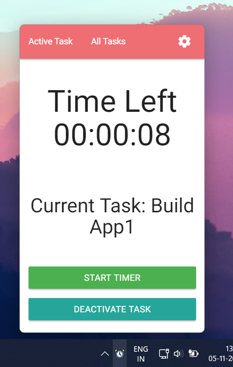
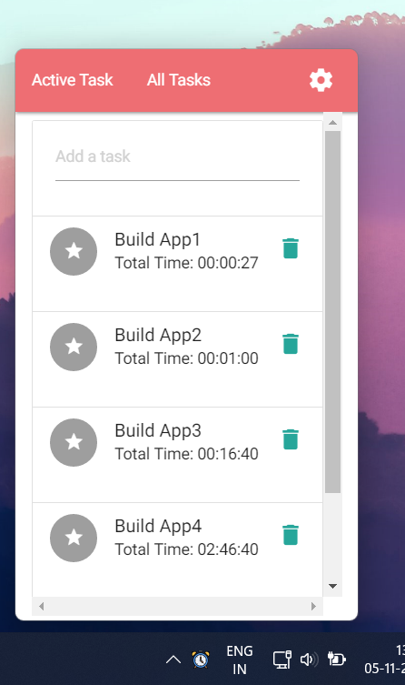
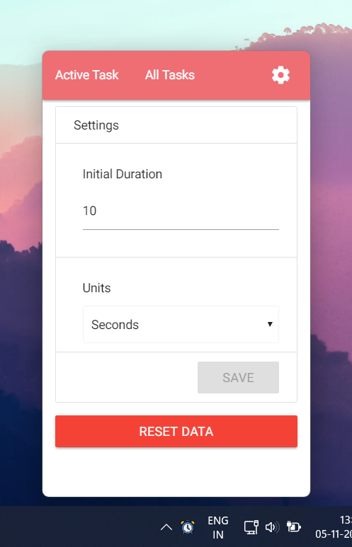

### Getting started

`npm install`

Start dev server:

`npm start`

In a new terminal window:

`npm run electron`

### This is a status Tray desktop application.
A simple application that can help you manage your tasks effectively.

;

;

;
